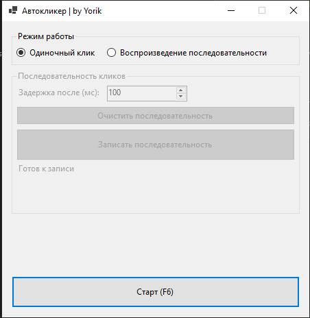

# 🖱️ AutoClickerX - автокликер для Windows

**AutoClickerX** - это инструмент для автоматизации работы с мышью, который поможет вам сэкономить время и упростить рутинные задачи.

## 🌟 Основные возможности

- **Три типа кликов**:
  - 🔘 Левый клик
  - 🔘 Правый клик
  - 🔘 Двойной клик
- **Гибкие режимы работы**:
  - ⏱️ Одиночные клики с настраиваемым интервалом
  - 📝 Запись и воспроизведение последовательностей кликов
- **Точное позиционирование**:
  - 🎯 Использование текущей позиции курсора
  - 📌 Указание точных координат
- **Простое управление**:
  - ▶️ Старт/стоп по F6
  - ⏺️ Запись последовательности по F5

## 🚀 Установка

1. Скачайте последнюю версию из [раздела Releases](https://github.com/YorikPRO231/AutoClickerX/releases)
2. Распакуйте архив
3. Запустите `AutoClicerX.exe`

## 🛠️ Как использовать

### Базовые операции:
- Нажмите **F6** для старта/остановки автокликера
- Выберите тип клика и интервал в главном окне

### Запись последовательности:
1. Нажмите "Записать последовательность"
2. Переместите курсор и нажимайте **F5** для добавления точек
3. Нажмите кнопку снова для завершения записи
4. Выберите режим "Последовательность" и нажмите F6 для воспроизведения

## 📦 Технические требования

- Windows 7/10/11
- .NET 8.0 Runtime
- Разрешение экрана не менее 1024x768

## 📜 Лицензия

MIT License - смотрите файл [LICENSE](LICENSE) для деталей

---
